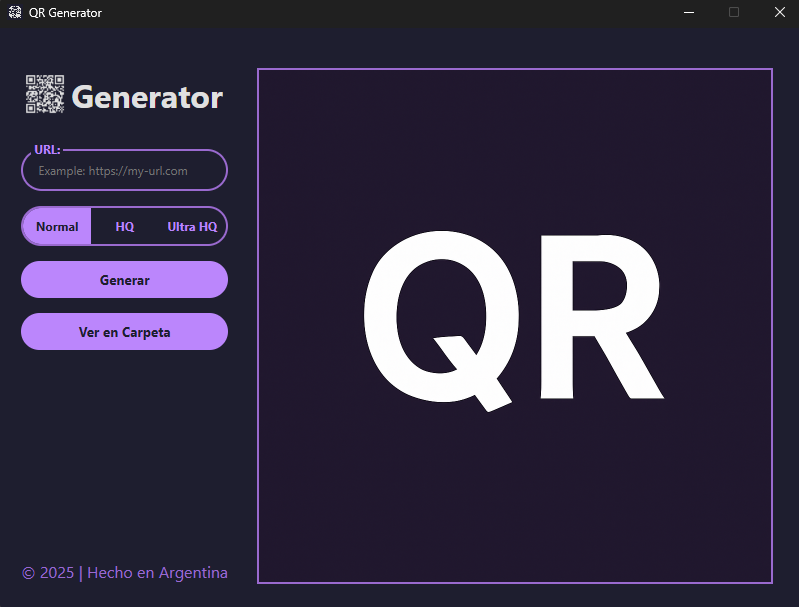

# QR Generator

A simple and lightweight desktop application for generating high-quality QR codes easily.

## 📷 Screenshot

## ✨ Features

- Generate QR codes from any URL
- Choose between Normal (512px), HQ (1024px), and Ultra HQ (3000px) quality
- Save QR codes locally inside a dedicated folder
- View the generated QR codes folder easily
- Modern and dark-themed user interface
- Lightweight, fast, and easy to use

## 🚀 Installation

1. Download the latest release from the [Releases](https://github.com/ZexionWhite/qr-generator/releases) page.
2. Run the installer and follow the setup steps.
3. Open the app and start generating your QR codes!

## 🛠 Technologies Used

- Electron
- Node.js
- qrcode (npm package)

## 👤 Author

- [ZexionWhite](https://github.com/ZexionWhite)

## 📄 License

This project is licensed under the [MIT License](LICENSE).

---
